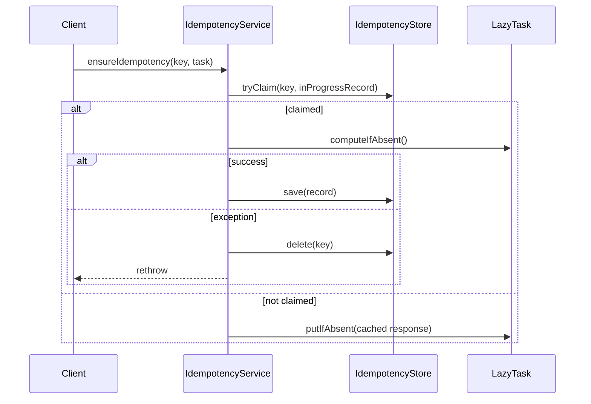
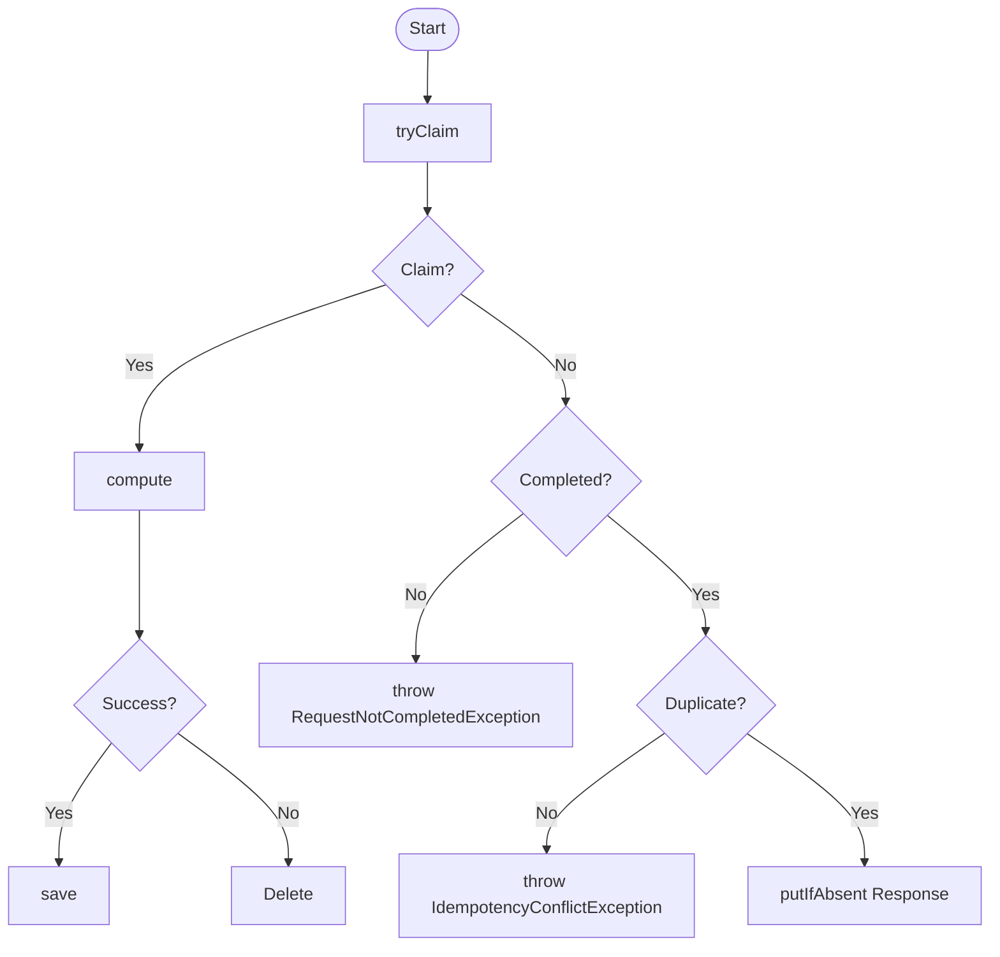
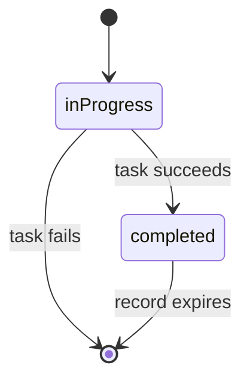
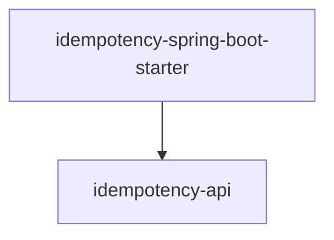

# Architecture — idempotency-service

## 1. Overview
- Vấn đề giải quyết: đảm bảo request trùng lặp không thực thi side-effect nhiều lần
- Phạm vi: các module con (`api`, `spring-boot-starter`)

## 2. Core Mechanism
- Interaction flow

- Logic flow

- State transition

## 3. Module Boundaries

## 4. Extension Points (Public API)
| Interface | Mục đích | Default implementation |
|---|---|---|
| `IdempotencyStore` | Nơi lưu record | `RedisIdempotencyStore` |
| `IdempotencyHasher` | Hash payload để phát hiện conflict | `JacksonIdempotencyHasher` |
| `IdempotencySerializer` | Serialize/deserialize response | `JacksonIdempotencySerializer` |

## 5. Key Design Decisions
### 1. LazyTask
- Bối cảnh: IdempotencyService.ensureIdempotency() cần orchestrate việc thực thi 1 tác vụ tuỳ ý (có thể có/không có input, có/không có output) mà không cần biết trước kiểu cụ thể của input/output đó.
- Quyết định: ensureIdempotency nhận và thao tác trên LazyTask<?, ?> - một holder chứa cả request lẫn logic thực thi - thay vì nhận trực tiếp kiểu response cụ thể và trả nó ra.
- Lý do: 
  - Đẩy type mapping ra ngoài biên của service: nếu nhận/trả kiểu cụ thể, service phải tự đảm bảo type xuyên suốt logic nội bộ (claim, save, deserialize cache), vượt quá trách nhiệm thật sự của nó (orchestration, không phải business logic). Với LazyTask<?, ?>, service không cần biết I/O là gì; type mapping nằm ở nơi tạo LazyTask, nơi có đủ thông tin đảm bảo type-safe tại compile-time.
  - Tránh type erasure ép phình method signature: nếu tự nhận Class<O> responseType để né type erasure, method phải cõng thêm tham số kỹ thuật bên cạnh tham số nghiệp vụ, dễ truyền sai thứ tự, khó đọc.
  - Tránh explosion overload theo tổ hợp input/output: không phải tác vụ nào cũng có cả input lẫn output (có thể chỉ input, chỉ output, hoặc không có gì). Không gói qua LazyTask, mỗi tổ hợp cần 1 overload riêng với cùng logic claim/save/delete lặp lại, khó maintain đồng bộ khi sửa core logic.
- Trade-off: LazyTask phải mutable, computeIfAbsent()/putIfAbsent() set response/computed trực tiếp lên instance đã tồn tại, để caller đọc lại getResponse() sau khi ensureIdempotency xử lý xong (side-effect, không phải return value). Đây là điểm dễ hiểu lầm nhất (trực giác thường mong holder immutable, hoặc mong service trả O trực tiếp), bắt buộc Javadoc mô tả rõ hành vi này trên cả LazyTask và ensureIdempotency.
### 2. Redis
- Quyết định: Dùng Redis làm store trung tâm cho việc claim và lưu IdempotencyRecord.
- Lý do: 
  - Atomic claim: Redis hỗ trợ thao tác atomic (SET NX) để nhiều request đồng thời cùng key chỉ có đúng 1 request claim thành công, loại bỏ race condition mà không cần lock thủ công ở tầng ứng dụng.
  - TTL built-in: Redis có cơ chế TTL sẵn, tự động hết hạn record cũ mà không cần job dọn dẹp riêng hay logic expire thủ công.
  - Schema linh hoạt: là NoSQL key-value store, không ràng buộc schema cố định như DB quan hệ, phù hợp với IdempotencyRecord có thể mở rộng field theo thời gian mà không cần migration.
  - Tốc độ cao: độ trễ thấp, giảm thiểu ảnh hưởng lên luồng nghiệp vụ chính khi mỗi request đều phải qua bước claim/lookup trước khi xử lý.
- Trade-off: Redis là external dependency thêm vào hệ thống, cần đảm bảo tính sẵn sàng (availability) của Redis, vì nếu Redis down, toàn bộ luồng có ensureIdempotency sẽ bị chặn theo. Ngoài ra, dữ liệu trong Redis (mặc định) không bền vững bằng DB quan hệ nếu không cấu hình persistence (RDB/AOF), cần cân nhắc nếu record cần tồn tại qua restart.
### 3. Concurrency
- Bối cảnh: Không có transaction để đảm bảo concurrency giữa nhiều client.
- Quyết định: dùng SETNX (Set if Not eXists) của Redis làm chốt chặn concurrency đầu tiên trong tryClaim; chỉ request claim thành công mới được phép tương tác ghi (save/delete) với store. 
- Lý do:
  - Atomic ở tầng Redis, không cần lock tầng ứng dụng: nếu ≥2 client cùng gửi request với cùng idempotency key tại cùng thời điểm, SETNX đảm bảo chỉ đúng 1 client claim thành công; các client còn lại nhận biết ngay lập tức là đã có người khác đang xử lý, không cần đồng bộ hoá qua lock/semaphore thủ công ở tầng service.
  - Write access có kiểm soát: chỉ client claim thành công mới được ghi (save khi hoàn tất, delete khi lỗi để cho phép retry); các client không claim được chỉ đọc trạng thái đã có, không bao giờ ghi đè lẫn nhau.
  - Hiệu quả: tận dụng cơ chế atomic native của Redis thay vì tự cài đặt distributed lock (ví dụ Redlock hay lock qua DB), vừa đơn giản hơn vừa ít điểm lỗi hơn cho đúng bài toán claim-once.
- Trade-off: đúng đắn của toàn bộ cơ chế phụ thuộc hoàn toàn vào tính atomic thật sự của SETNX trên Redis, nếu dùng Redis Cluster hoặc bất kỳ layer proxy nào phá vỡ tính atomic đơn-lệnh này, cơ chế claim sẽ không còn đảm bảo correctness. Cũng cần lưu ý: SETNX chỉ giải quyết concurrency ở bước claim, race condition ở các bước sau (ví dụ giữa lúc claim thành công và lúc save) vẫn phải xử lý bằng try/catch + delete-on-failure (đã mô tả ở phần cơ chế core).
### 4. API Idempotency key
- Bối cảnh: Đảm bảo idempotency cho Rest endpoint
- Quyết định: Quy định phải có tenantId, method và path gửi request cùng với key ngẫu nhiên để tổng hợp thành Idempotency key
- Lý do:
  - Cô lập theo tenant: ghép tenantId vào key đảm bảo 2 tenant khác nhau dùng trùng key ngẫu nhiên (do trùng UUID hiếm gặp, hoặc do client tự sinh key không đủ ngẫu nhiên) không bị nhận nhầm là cùng 1 request, tránh rò rỉ dữ liệu chéo tenant hoặc trả nhầm cached response.
  - Cô lập theo endpoint: ghép method + path đảm bảo cùng 1 key ngẫu nhiên gửi tới 2 endpoint khác nhau (ví dụ client vô tình tái sử dụng key cũ) không bị coi là duplicate của nhau; mỗi endpoint có không gian key riêng biệt.
  - Ép đúng thứ tự tại compile-time: dùng staged builder (TenantStep, MethodStep, PathStep, KeyStep) thay vì fluent builder thông thường, đảm bảo không thể vô tình bỏ sót hoặc gọi sai thứ tự 1 trong 4 thành phần khi build key, lỗi sai thứ tự sẽ bị compiler chặn thay vì phát hiện lúc runtime.
- Trade-off: Tăng độ dài và độ phức tạp của key, đổi 1 trong 4 thành phần sẽ đổi toàn bộ key.
### 5. API separation
- Bối cảnh: Publish API không phụ thuộc dependency
- Quyết định: Dùng interface để đảo ngược sự phụ thuộc từ API đến các dependency
- Lý do:
  - idempotency-api không kéo theo transitive dependency thừa.
  - Consumer tự do chọn/thay implementation.
  - Version hoá độc lập từng phần: Không ép mọi consumer nâng version api chỉ vì 1 implementation đổi version.
- Trade-off: Một số type bị ép public dù không mong muốn, thêm tầng gián tiếp và đòi hỏi kỷ luật enforce contract.

## 6. Rejected Alternatives
### 1. Built into Microservice/SaaS
- Complex distributed transaction: If idempotency service failed, a rollback would occur over the network.
- Extra network round-trip and additional failure point.
- Unsuitable features: No multi-tenancy, no billing, no SLA, no security audit then no service at all.
### 2. An interface for IdempotencyService
- No logical alternatives for IdempotencyService.
- Increasing maintenance burden: Adding an interface increases maintenance burden and requires discipline to enforce contracts.